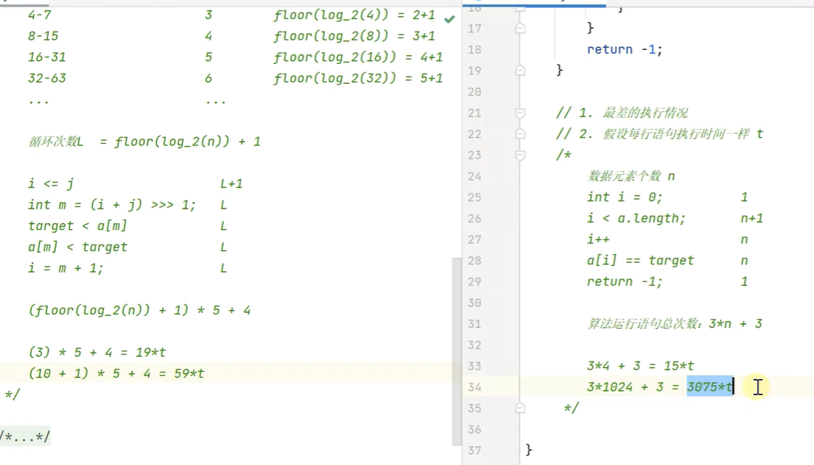
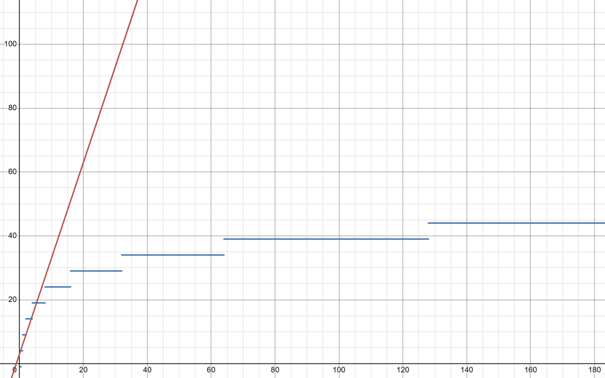
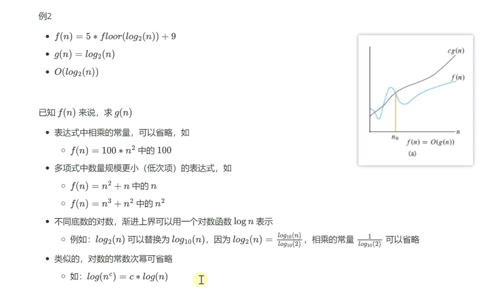

# JAVA数据结构与算法

## 一.二分查找

### 1.二分查找(binarySearch)

需求:在**有序**数组A内,查找值target

+ 如果找到则返回索引
+ 找不到返回-1

| 算法描述 |                                                              |
| -------- | ------------------------------------------------------------ |
| 前提     | 给定一个内含n个元素的有序数组A,从小到大排列,输入一个待查值target |
| 1        | 设置i = 0,j = n-1                                            |
| 2        | 如果i > j,结束查找,没找到                                    |
| 3        | 设置m=floor((i+j)/2),m为中间索引,floor是向下取整             |
| 4        | 如果target<$A_m$ 设置j = m-1,跳到第二步                      |
| 5        | 如果target>$A_m$ 设置i= m+1,跳到第二步                       |
| 6        | 如果$A_m$ = target,结束查找,找到了                           |

### 2.算法实现

```java
public static int binarySearchBasic(int []a, int target){
    int i = 0, j = a.length - 1;
    while( i <= j){
        int mid = (i + j) / 2; //要放在循环里面,循环一次中间值就改变一次
        if(target < a[mid]){
            j = m - 1;
        }else if(a[mid] < target){
            i = m + 1;
        }else{
            return m;
        }
    }
    return -1;
}
```

### 3.问题总览

问题1: 为什么是 i<= j ,而不是 i<j ?

解答: 如果是 i<j ,那么 i = j 的情况就不能进入循环,那么当target 是最后 i = j的时候才找到的话,就无法查找了

问题2: (i + j) / 2 有没有问题

解答: 其实是有问题的,当j特别大的时候, (i+j)/ 2超过了int的最大取值范围,就会变成负数,因为当超过int的32位后就会默认首位是符号位,那么首位是1,就会变成负数

不过,可以使用 (i + j) >>> 2 ,使用向右移一位来除以二就没有问题,因为无符号数向右移一位是在首位补0,所以不会出现错误

### 4.二分查找改动版

二分查找改动版:

```java
public static int binarySearchBasic(int []a, int target){
    int i = 0, j = a.length; //第一处改动
    while( i < j){  //第二处改动,不能加上=,不然当查找不存在的数时会陷入死循环
        int mid = (i + j) / 2; //要放在循环里面,循环一次中间值就改变一次
        if(target < a[mid]){
            j = m;  //第三处改动
        }else if(a[mid] < target){
            i = m + 1;
        }else{
            return m;
        }
    }
    return -1;
}
```

###  5.评价算法的好坏

左右分别是二分查找和线性查找的代码行总共的执行次数和执行时间



红色为线性查找,蓝色为二分查找,通过函数图比较我们就知道了二者区别之大

### 6.时间复杂度

时间复杂度:一个算法的执行,随数据规模增大,而增长的时间成本

+ 不依赖于环境因素

如何表示时间复杂度:

+ 假设算法要处理的数据规模是n,代码总执行行数使用函数f(n)来表示,例如:

  + ###### 线性查找的算法的函数是  f(n) = 3 * n + 3

  + ###### 二分查找算法的函数是 f(n) = (floor(log_2(n)+1)*5+4) 

+ 为了对f(n)进行化简,应该抓住主要矛盾,找到一个变化趋势与之相近的表示法


比如:

+ f(n) = 3*n + 3
+ g(n) = n
+ 当c取4时,在$n_0$ = 3 之后,g(n)可以作为f(n)的渐进上界,所以表示法可以写作O(n)

时间复杂度判断规律:



常见的时间复杂度


### 7.空间复杂度

时间复杂度:衡量算法在执行时间上的好与坏

空间复杂度:算法在空间占用上的好坏

空间复杂度一般也使用大O表示法来衡量:一个算法执行随数据规模增大,而增长的**额外**空间成本

比如说,还是使用二分查找来说明:

```java
public static int binarySearchBasic(int []a, int target){
    int i = 0, j = a.length - 1;
    while( i <= j){
        int mid = (i + j) / 2; //要放在循环里面,循环一次中间值就改变一次
        if(target < a[mid]){
            j = m - 1;
        }else if(a[mid] < target){
            i = m + 1;
        }else{
            return m;
        }
    }
    return -1;
}
```

其中 int 类型的 i , j分别占了四个字节, mid也占了四个字节,所以在数组之外的额外花费是12个字节

所以二分查找的空间复杂度就是一个常量,也就是 $O(1)$

### 8.二分查找的性能

时间复杂度

+ 最坏情况: $O(log_n)$
+ 最好情况: 如果待查找元素恰好在数组中央, 只需要循环一次 $O(1)$

空间复杂度

+ 需要常数个指针i,j,m,因此额外占有的空间是$O(1)$

### 9.二分查找平衡版

当我们观察二分查找的算法的时候可以发现一个问题

```java
public static int binarySearchBasic(int []a, int target){
    int i = 0, j = a.length - 1;
    //假设我们循环了L次, 当要查找的元素在最左边时, 我们要执行L次if语句
    //但是当我们查找最右边的元素时,我们要先执行L次if语句,再执行L次else if语句
    //总共2L次,发现问题了,我们基础版的算法在左边和右边的效率是不一样的
    //所以我们引出了二分查找平衡版
    while( i <= j){
        int mid = (i + j) / 2;
        if(target < a[mid]){
            j = m - 1;
        }else if(a[mid] < target){
            i = m + 1;
        }else{
            return m;
        }
    }
    return -1;
}
```

 下面是平衡版的实现算法:

```java
public static int bin
```

