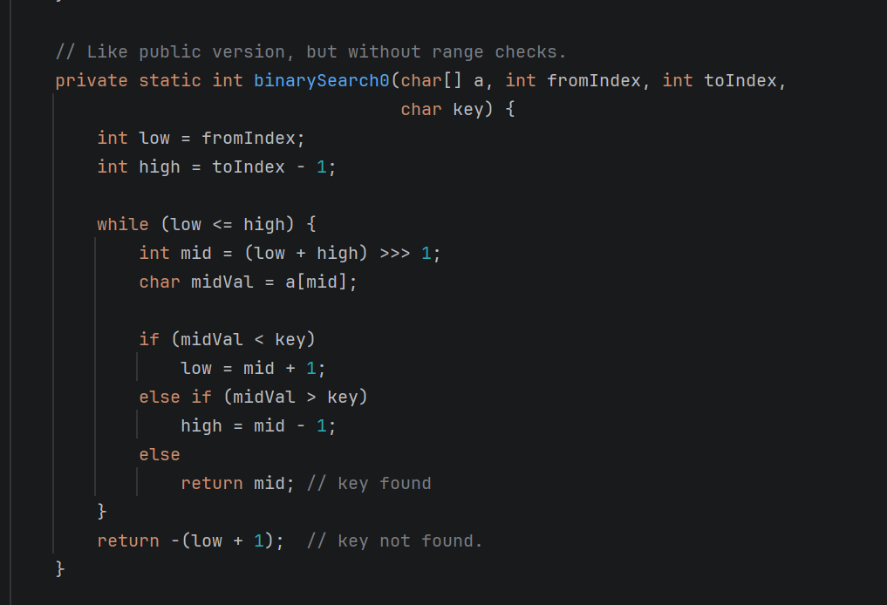

# JAVA数据结构与算法

## 一.二分查找

### 1.二分查找(binarySearch)

需求:在**有序**数组A内,查找值target

+ 如果找到则返回索引
+ 找不到返回-1

| 算法描述 |                                                              |
| -------- | ------------------------------------------------------------ |
| 前提     | 给定一个内含n个元素的有序数组A,从小到大排列,输入一个待查值target |
| 1        | 设置i = 0,j = n-1                                            |
| 2        | 如果i > j,结束查找,没找到                                    |
| 3        | 设置m=floor((i+j)/2),m为中间索引,floor是向下取整             |
| 4        | 如果target<$A_m$ 设置j = m-1,跳到第二步                      |
| 5        | 如果target>$A_m$ 设置i= m+1,跳到第二步                       |
| 6        | 如果$A_m$ = target,结束查找,找到了                           |

### 2.算法实现

```java
public static int binarySearchBasic(int []a, int target){
    int i = 0, j = a.length - 1;
    while( i <= j){
        int mid = (i + j) / 2; //要放在循环里面,循环一次中间值就改变一次
        if(target < a[mid]){
            j = m - 1;
        }else if(a[mid] < target){
            i = m + 1;
        }else{
            return m;
        }
    }
    return -1;
}
```

### 3.问题总览

问题1: 为什么是 i<= j ,而不是 i<j ?

解答: 如果是 i<j ,那么 i = j 的情况就不能进入循环,那么当target 是最后 i = j的时候才找到的话,就无法查找了

问题2: (i + j) / 2 有没有问题

解答: 其实是有问题的,当j特别大的时候, (i+j)/ 2超过了int的最大取值范围,就会变成负数,因为当超过int的32位后就会默认首位是符号位,那么首位是1,就会变成负数

不过,可以使用 (i + j) >>> 2 ,使用向右移一位来除以二就没有问题,因为无符号数向右移一位是在首位补0,所以不会出现错误

### 4.二分查找改动版(binarySearchAlternative)

二分查找改动版:

```java
public static int binarySearchBasic(int []a, int target){
    int i = 0, j = a.length; //第一处改动
    while( i < j){  //第二处改动,不能加上=,不然当查找不存在的数时会陷入死循环
        int mid = (i + j) / 2; //要放在循环里面,循环一次中间值就改变一次
        if(target < a[mid]){
            j = m;  //第三处改动
        }else if(a[mid] < target){
            i = m + 1;
        }else{
            return m;
        }
    }
    return -1;
}
```

###  5.评价算法的好坏

左右分别是二分查找和线性查找的代码行总共的执行次数和执行时间


红色为线性查找,蓝色为二分查找,通过函数图比较我们就知道了二者区别之大

### 6.时间复杂度

时间复杂度:一个算法的执行,随数据规模增大,而增长的时间成本

+ 不依赖于环境因素

如何表示时间复杂度:

+ 假设算法要处理的数据规模是n,代码总执行行数使用函数f(n)来表示,例如:

  + ###### 线性查找的算法的函数是  f(n) = 3 * n + 3

  + ###### 二分查找算法的函数是 f(n) = (floor(log_2(n)+1)*5+4) 

+ 为了对f(n)进行化简,应该抓住主要矛盾,找到一个变化趋势与之相近的表示法


比如:

+ f(n) = 3*n + 3
+ g(n) = n
+ 当c取4时,在$n_0$ = 3 之后,g(n)可以作为f(n)的渐进上界,所以表示法可以写作O(n)

时间复杂度判断规律:


常见的时间复杂度


### 7.空间复杂度

时间复杂度:衡量算法在执行时间上的好与坏

空间复杂度:算法在空间占用上的好坏

空间复杂度一般也使用大O表示法来衡量:一个算法执行随数据规模增大,而增长的**额外**空间成本

比如说,还是使用二分查找来说明:

```java
public static int binarySearchBasic(int []a, int target){
    int i = 0, j = a.length - 1;
    while( i <= j){
        int mid = (i + j) / 2; //要放在循环里面,循环一次中间值就改变一次
        if(target < a[mid]){
            j = m - 1;
        }else if(a[mid] < target){
            i = m + 1;
        }else{
            return m;
        }
    }
    return -1;
}
```

其中 int 类型的 i , j分别占了四个字节, mid也占了四个字节,所以在数组之外的额外花费是12个字节

所以二分查找的空间复杂度就是一个常量,也就是 $O(1)$

### 8.二分查找的性能

时间复杂度

+ 最坏情况: $O(log_n)$
+ 最好情况: 如果待查找元素恰好在数组中央, 只需要循环一次 $O(1)$

空间复杂度

+ 需要常数个指针i,j,m,因此额外占有的空间是$O(1)$

### 9.二分查找平衡版(binarySearchBalance)

当我们观察二分查找的算法的时候可以发现一个问题

```java
public static int binarySearchBasic(int []a, int target){
    int i = 0, j = a.length - 1;
    //假设我们循环了L次, 当要查找的元素在最左边时, 我们要执行L次if语句
    //但是当我们查找最右边的元素时,我们要先执行L次if语句,再执行L次else if语句
    //总共2L次,发现问题了,我们基础版的算法在左边和右边的效率是不一样的
    //所以我们引出了二分查找平衡版
    while( i <= j){
        int mid = (i + j) / 2;
        if(target < a[mid]){
            j = m - 1;
        }else if(a[mid] < target){
            i = m + 1;
        }else{
            return m;
        }
    }
    return -1;
}
```

 下面是平衡版的实现算法:

```java
public static int binarySearchBalance(int[]a, int target){
        int i = 0, j = a.length;
        while(1 < j - i){
            int mid = (i + j) >>> 1;
            if(target < a[mid]){ //避免了else if 的使用,避免了数据查找效率不均匀的情况
                j = mid;
            }else {
                i = mid; //i = mid, 不能再+1了,否则就考虑不到正好在索引为1的情况了
            }
        }
        if(target == a[i]){
            return i;
        }else{
            return -1;
        }
    }
}
```

优点:在数据量大的时候,体现比较明显,效率更高

缺点:二分查找基础版最好情况是$O(1)$,但是平衡版最好和最坏的情况都是$O(log(n))$

不过缺点可以忽略,相比较来说,优点比缺点好很多

### 10.二分查找java版

我们可以找到在java中的binarySearch是怎么实现的



采用的是我们basic的方法,但是为什么最后一行是 $-(low + 1)$呢

这是因为java中想表示的是,返回的是插入点,比如说一个数组 {2 , 3,  5, 9 }

我们查找4, 发现4不在这个数组中,并且返回了一个 - 3

这是因为, 最后这一行是返回  -插入点 - 1  ,我们没查找到4,如果想插入4的话,应该是插入到索引为2的位置上,

所以返回 -2-1 ,也就是 -3

也就是说 low 就是插入点

那么既然都有了插入点,我们多引申一点插入索引数字到数组的方法:

```java
public static int[] addIndexNumber(int[]a, int target){
        int insertIndex = Math.abs(Arrays.binarySearch(a, target) + 1); //插入点索引
        int[]b = new int[a.length + 1];
        System.arraycopy(a, 0, b, 0, insertIndex);
        //解释一下System.arraycopy,也就是把要复制的数组(a)从索引0开始复制n个元素(insertIndex)到数组b,并且从b的索引0开始
        b[insertIndex] = target;
        System.arraycopy(a, insertIndex, b, insertIndex + 1, a.length - insertIndex);
        return b;
    }
```

使用:

```java
public static void main(String[] args) {
        int []a = {2, 5, 8};
        int target = 4;
        int []newArray = addIndexNumber(a, target);
        System.out.println(Arrays.toString(newArray));
    }
```

### 11.二分查找LeftRightmost

如果数组中有相同大小的元素,查找最前面的目标元素

代码实现:

```java
public class BinarySearchLeftRightMost {
    public static int binarySearchLeftRightMost(int[] a, int target) {
        int i = 0, j = a.length - 1;
        int candidate = -1;
        while (i <= j) {
            int mid = (i + j) >>> 1;
            if (a[mid] < target) {
                j = mid - 1;
            } else if (a[mid] > target) {
                i = mid + 1;
            } else {
                //记录候选位置
                candidate = mid;
                j = mid - 1;
                //RightMost的区别是j = mid - 1改为 i = mid + 1,向右找
            }
        }
        return candidate;
    }
}
```

BinarySearchLeftRightMostAlternative(改动返回值)

```kotlin
//public class BinarySearchLeftRightMostAlternative {
//    public static int binarySearchLeftRightMostAlternative(int[]a, int target){
//        int i = 0, j = a.length - 1;
//        while( i <= j ){
//            int mid = (i + j) >>> 1;
//            if(target <= a[mid]){ //当目标值在中间值的上方或者左边时移动右边指针
//                j = mid - 1;
//            }else{
//                i = mid + 1;
//            }
//        }
//        return i;  //最后不再返回-1,而是返回一个有意义的值i,i代表着如果能找到元素,返回最左边查找到的索引
//        //如果找不到元素,返回大于等于目标的最靠左的索引位置
//    }
//}

public class BinarySearchLeftRightMostAlternative {
    public static int binarySearchLeftRightMostAlternative(int[]a, int target){
        int i = 0, j = a.length - 1;
        while( i <= j ){
            int mid = (i + j) >>> 1;
            if(target < a[mid]){ //当目标值在中间值的上方或者左边时移动左边指针
                j = mid - 1;
            }else{
                i = mid + 1;
            }
        }
        return i - 1;  //最后不再返回-1,而是返回一个有意义的值i,i代表着如果能找到元素,返回最右边查找到的索引
        //如果找不到元素,返回小于等于目标的最靠右的索引位置
    }
}

```

### 12.二分查找LeftRightmost的应用


1. 求排名:要找到最左侧的4,才知道4的排名是多少,所以使用(leftmost(4) = 2 + 1)
2. 求前任:4的前任,使用(leftmost(4) - 1)
3. 求后人:5的后任,使用(rightmost(5) + 1)
4. 最近邻居:求出前任和后任,之后求出两个之中小的那个
5. 查找范围:如果想查找x < 4的范围: 求的是 0..leftmost(4) - 1

​                        如果像查找x <= 4的范围: 求的是 0..rightmost(4) 

​                        如果想查找x > 4的范围: 求的是 rightmost(4) + 1 .. a.length

​                        如果想查找x >= 4的范围: 求的是 leftmost(4) .. l.length

​                        如果想查找4 <= x <= 7的范围: 求的是 leftmost(4) .. rightmost(7)

​                        如果想查找4 < x < 7的范围: 求的是 leftmost(4)+1  .. rightmost(7)-1

### 13.leetcode相关题目(leetcode 34, 35, 704)

1. 

```java
class Solution {
    public int search(int[] nums, int target) {
        int i = 0, j = nums.length - 1;
        while(i <= j){
            int mid = (i + j) >>> 1;
            if(nums[mid] < target){
                i = mid + 1;
            }else if(nums[mid] > target){
                j = mid - 1;
            }else{
                return mid;
            }
        }
        return -1;
    }
}
```

2. 

```java
class Solution {
    public int searchInsert(int[] nums, int target) {
        int i = 0, j = nums.length;
        while(i < j){
            int mid = (i + j) >>> 1;
            if(target < nums[mid]){
                j = mid;
            }else if(target > nums[mid]){
                i = mid + 1;
            }else{
                return mid;
            }
        }
        return i;
    }
}
```

3. 

```java
class Solution {
    public int[] searchRange(int[] nums, int target) {
       int x = findBound(nums, target, true);
       if(x == -1){
        return new int[]{-1, -1};
       }else{
        return new int[]{x, findBound(nums, target, false)};
       }
    }

    public int findBound(int[]nums, int target, boolean findleft){
        int i = 0, j = nums.length - 1;
        int result = -1;
        while(i <= j){
            int mid = (i + j) >>> 1;
            if(target == nums[mid]){
                result = mid;
                if(findleft){
                    j = mid - 1;
                }else{
                    i = mid + 1;
                }
            }else if(target < nums[mid]){
                j = mid - 1;
            }else{
                i = mid + 1;
            }
        }
        return result;
    }
}

```

